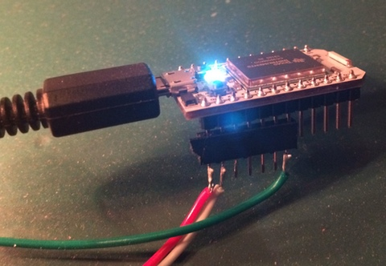

MessageTorch
============

**A small fun project using a WS2812 color LED strip and a spark.io core WiFi+Cloud enabled prototyping board.**

End of last year, at the incredibly great [30C3 chaos communication congress](http://media.ccc.de/browse/congress/2013/) in Hamburg, I learnt of the existence of WS2812 LED chips. Shame on me I wasn't aware of them before. These are RGB LEDs with a built-in controller which allows chaining hundreds of them and controlling each LED individually via a single output pin of a microcontroller, at a speed suitable for complex animations.

At 30C3, there were many many WS2812 based and very colorful light installations, but the one that fascinated me most was a rather small and nearly monochrome one. It was a LED strip with some 200 WS2812, wound onto a tube of approximately 7cm diameter and maybe 70cm height. The tube stood vertically on a desk and showed an animation that made the tube look like a torch on fire. The fascinating thing was that it really created a feeling of fire, despite the very limited resolution (after all, it had only 200 "pixels" around the tube, so what you could see at once were probably less 100 LEDs). But the effect was really stunning.

Luckily, the creator of the torch was explaining how the did the calculations for the animation just the moment I passed by. Not in great detail, but I got the basic idea which later, back at home, transformed to my version - the "MessageTorch".

I would very much like to give him credit for this awesome idea - if I only knew his name. I tried to find out afterwards but without success so far (hints welcome, if anyone saw it too and knows who is the creator, please let me know).

Anyway, back at home I ordered some WS2812 led strips ([4m ones with 240 chips each](http://www.aliexpress.com/item/4M-240-chips-5050-RGB-SMD-60-Pixels-M-WS2811-IC-WS2812B-WS2812-Digital-Strip-2812/1587858490.html)). And nearly the same day the strips were delivered, the Kickstarter reward from the awesome [spark.io "spark core" project](https://www.spark.io) also arrived.

So the formula was: Idea from Blinkenlights@30c3 + spark.core + WS2812 strip -> do something with that!

Driving WS2812 chains
---------------------
First step was to get the [WS2812 serial protocol](http://www.adafruit.com/datasheets/WS2812.pdf) generated by the spark core. The timing must be quite accurate (only 150nS tolerance). By now there are several libraries for that on github, but before I found those I had [written my own](https://github.com/plan44/ws2812_spi_sparkcore), partly out of the challenge to figure it out myself, using SPI for generating the timing.

Wiring + Power
--------------
Wiring the WS2812 LED strips to the spark.core is super simple: the strip has three wires, ground, 5V and data. Ground goes to GND of spark.core, 5V to VIN and data to A5 (SPI MOSI):

This works fine with a ordinary 5V/1A USB power supply with one big caveat: don't try to switch on all LEDs at full brightness. A 240 LED WS2812 chain, all LEDs set to bright white, would consume around 14Amps (70 Watts!). A small USB power supply will simply collapse when connected to such a load, usually by overload protection switching it off, but really cheap ones might simply die. Having said that - for the MessageTorch that simple 5V/1A is sufficient, as only few LEDs are actually on together at a given time.

Torch simulation
----------------

I tried to code what the original creator of the torch explained. Each pixel has an amount of "energy". Pixels dissipate their energy up and sidewards to neighbour pixels. A very "hot" pixel will show in white/blue, cooler ones in yellow down to dim red. In the bottom row, pixels receive a random amount of "energy" in every cycle. In addition, some special spark pixels (which keep their energy while moving up) are randomly generated in the second row. There's lot of room for improvement, of course...

Via the Cloud - Message display
-------------------------------
Now once this worked, there was the cloud API of the spark to do something with. So I added the message display part. Any text message sent to the torch via the spark API is rendered in a good old 5x7 pixel font I found hex code for somewhere in the depths of my old projects. The message first shows bright blue, and then fades with every repetition.  

The MessageTorch is standing near our coffee table in the office, so I hacked a website so [everyone can send us a message](http://mixwerk.ch/message). Around 10AM CET chances are good messages are seen...

For your own spark cores, of which you have the device ID and access token, the message can be sent directly:

curl https://api.spark.io/v1/devices/xxxxxxx/message -d access_token=tttt -d "args=Hello Spark"

Parameters
----------
The development cycle on the spark core via the web IDE is rather slow, as every update apparently re-flashes not only the user code, but the entire firmware. So to play with the animations, colors etc. I added a lot of parameters that can be set via the cloud API:

curl https://api.spark.io/v1/devices/xxxxxxx/params -d access_token=tttt -d "args=mode=2,brightness=255"

To see what parameters are supported, check out the handleParams() function around line 465 of the code.

Finally - integration into digitalSTROM home automation
-------------------------------------------------------
As my current work is an open source project for integrating third-party devices into the [digitalSTROM](http://www.digitalstrom.com/index.php?cl=start&lang=1) home automation system, our office lighting is fully automated. Coffee table lights (colored LEDs, of course) go on when the coffee machine is switched on etc.

So of course I also wanted the MessageTorch to be part of that, and that's what the third cloud API called "vdsd" is about. That means "virtual digitalstrom device" and it interfaces to the "vdcd" software component which then includes the MessageTorch as a dimmable lamp into the system.

Adapting to your LED chain and tube diameter
--------------------------------------------
There are two constants in the source around line 365, "ledsPerLevel" and "levels". "ledsPerLevel" must be set to the number of LEDs in one winding of the LED chain around (or in my case, inside the plexiglass) tube. "levels" must be the number of windings. Of course "ledsPerLevel" times "levels" must not exceed the total number of LEDs in the chain.
 

